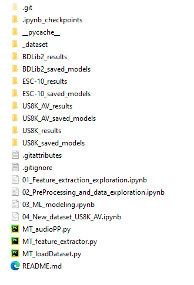

# Master_thesis_Andre_Luiz_Florentino_project

### Faculdade de Engenharia Industrial - FEI

### Centro Universitário da Fundação Educacional Inaciana "Padre Sabóia de Medeiros" (FEI)

*FEI's Stricto Sensu Graduate Program in Electrical Engineering*

Concentration area: ARTIFICIAL INTELLIGENCE APPLIED TO AUTOMATION AND ROBOTICS

Master's thesis student Andre Luiz Florentino

***

The main purpose of this repository is to provide all codes in either Jupyter notebook format or native .py format, enabling interested parties to reproduce the results obtained in my master's thesis. To achieve the same results, it is essential to follow the guidelines outlined below:

1. The .py files are used in Jupyter notebooks. They will not generate meaningful results if run alone, without the appropriate context.
2. The Jupyter notebooks are intentionally numbered. It is important to run each notebook until the end before moving on to the next one, as skipping ahead may result in missing key information.
3. Some of the scripts are very time consuming, therefore, when it's recommended to run them overnight;
4. The training and testing of the models were performed on a notebook equipped with an Intel® Core™ i7-10850H CPU @2,70 GHz, 80 GB of RAM, and a Quadro T2000 graphics card with 4 GB of memory. The operational system in use was Windows 10 Enterprise. It may be necessary to adjust some of the codes if one has less computational power, and specially, less memory (RAM) capacity;
5. The content of the folders below were intentionally ignored in this repository, however, the files were listed in the end of this document.

***
### List of Jupyter notebooks

* *01_Feature_extraction_exploration.ipynb:* 

Read the datasets and perform several data exploration on features. Outputs the script (class): MT_loadDataset.py

* *02_PreProcessing_and_data_exploration.ipynb:* 

Pre-process the audio with augmentations and windowing techniques. Outputs the scripts (classes) for pre-processing and feature extraction: MT_audioPP.py and MT_feature_extractor.py

* *03_New_dataset_US8K_AV.ipynb:* 

Creates the new dataset **US8K_AV** based on the source US8K.

* *04_ML_modeling.ipynb:* 

Machine learning modeling for the classifiers: Gaussian Naïve Bayes (GNB), Support Vector Machine (SVM), Logistic Regression (LR), K-Nearest Neighbors (k-NN), Random Forest (RF) and voting soft / hard.

***

### List of scripts .PY 

In order of utilization in the Jupyter notebooks:

* MT_loadDataset.py
* MT_audioPP.py
* MT_feature_extractor.py